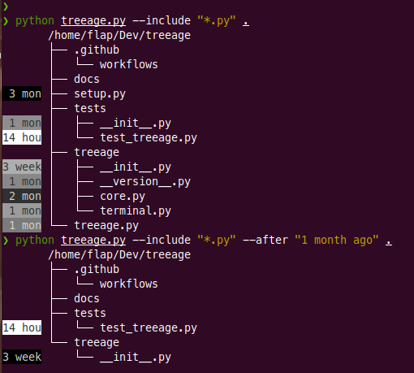

.. image:: http://github.com/kraymer/treeage/workflows/build/badge.svg
   :target: https://github.com/kraymer/treeage/actions   
.. image:: http://img.shields.io/pypi/v/treeage.svg
   :target: https://pypi.python.org/pypi/treeage
.. image:: https://codecov.io/gh/Kraymer/treeage/branch/master/graph/badge.svg?token=NWHZ0T10O2
   :target: https://codecov.io/gh/Kraymer/treeage
.. image:: https://img.shields.io/badge/releases-atom-orange.svg
   :target: https://github.com/Kraymer/treeage/releases.atom

.. pypi

treeage
=======

    **/ˈtreeage/**
    
    | 1. *n.* a process in which things are ranked in terms of importance or priority.
    | 2. *n.* software that lists contents of directories in a tree-like format with age metric indicated for each file

``treeage`` display is typically used to shed some light on antiquated parts of a codebase and identify candidates for a refactoring.

Install
-------

``treeage`` is written for Python 3.5+, install with pip via ``pip3 install treeage`` command.

Usage
-----

::

    Usage: treeage.py [OPTIONS] DIRECTORY    

      Lists contents of directories in a tree-like format with age metric
      indicated for each file.    

    Options:
      --maxdepth LEVELS  Descend at most LEVELS (a non-negative integer) levels of
                         directories below the seed DIRECTORY    

      --include GLOB     Search only files whose base name matches GLOB (using
                         wildcard matching)    

      -h, --help         Show this message and exit.    

Screenshot
----------

